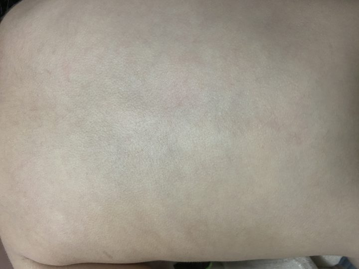
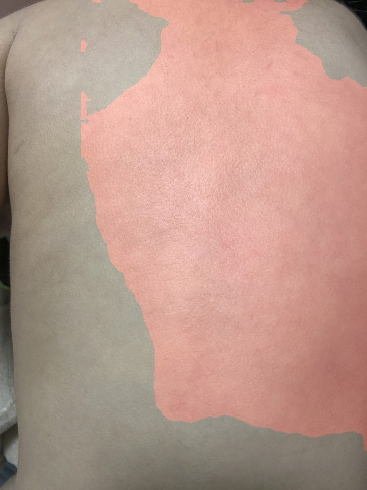

<p align="center">
  
</p>

# ATOMOM Lesion Analyzer

Cleaned and reorganized skin lesion analysis server for local inference and lightweight Django demo serving.

## Overview

This repository contains a lesion-analysis pipeline built around:

- EfficientNet-based classification
- YOLO-based lesion segmentation
- optional Mask R-CNN support
- a minimal Django demo app for image upload and result rendering

The codebase was restructured to separate active runtime code from archived legacy experiments. Old scripts, backup views, deprecated templates, and unused helpers now live under `legacy/`.

## Demo

| Input | Segmentation output |
| --- | --- |
|  |  |

## What Changed

- consolidated runtime code into `app_config/`, `pipelines/`, `backend/`, `scripts/`, `vendor/`, and `models/`
- archived deprecated scripts, old Django views, old templates, and product-schema models into `legacy/`
- replaced scattered runner scripts with a single unified CLI: `scripts/run_inference.py`
- simplified the Django app into an inference-focused upload UI
- normalized local data layout under `test_data/`
- moved generated outputs and debug artifacts under `artifacts/`

For a compact cleanup log, see [docs/CLEANUP_SUMMARY.md](docs/CLEANUP_SUMMARY.md).

## Active Layout

```text
.
|- app_config/          # model registry, paths, runtime presets
|- backend/             # Django demo server
|- docs/                # README assets and cleanup notes
|- legacy/              # archived experiments and deprecated code
|- models/              # local-only weight directory layout
|- pipelines/           # classification/segmentation pipeline code
|- scripts/             # unified CLI entry point
|- test_data/           # local samples and dataset notes
`- vendor/              # vendored third-party runtime modules
```

## Weight Files

Model weights are expected locally and are intentionally not committed.

Place them under:

```text
models/weights/classification/primary_efficientnet.pt
models/weights/classification/secondary_efficientnet.pt
models/weights/segmentation/yolo/lesion_yolo.pt
models/weights/segmentation/mrcnn/lesion_mask_rcnn.h5
```

The default runtime uses EfficientNet + YOLO. Mask R-CNN support remains available but is not enabled in the default preset.

## Quick Start

### 1. Run the unified CLI

```bash
python scripts/run_inference.py pipeline --image test_data/images/samples/normal_002.JPG
```

Other modes:

```bash
python scripts/run_inference.py classifier --classifier primary --image test_data/images/samples/normal_002.JPG
python scripts/run_inference.py yolo --image test_data/images/samples/normal_002.JPG --output docs/assets/sample_result.jpg
python scripts/run_inference.py mrcnn --image test_data/images/samples/normal_002.JPG --show
```

### 2. Run the Django demo server

```bash
cd backend
python manage.py runserver
```

Then open `http://127.0.0.1:8000/`.

## Validation

The cleaned repository has been verified with:

- pipeline inference smoke test on `test_data/images/samples/normal_002.JPG`
- classifier-only smoke test through the unified CLI
- `python manage.py check` from `backend/`
- `py_compile` checks across backend, pipeline, and script modules

## Notes

- `legacy/` is intentionally retained for reference and recovery, not for active development.
- `test_data/README.md` documents the local sample/data folder layout.
- `scripts/README.md` documents the active CLI entry point.
